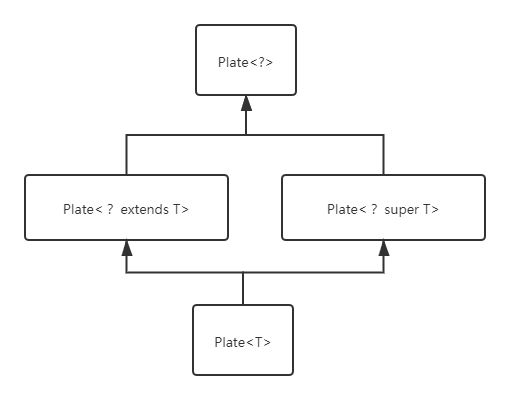

## 1. 自己 使用 javac javap -c 反汇编后看看字节码 擦除机制  super是如何处理的

```java
public class Test {  
    public static void main(String[] args) {  
        List<Integer> integerList = new ArrayList<>();  
        addNumber(integerList);  
        System.out.println(integerList);  
    }  
  
    public static void addNumber(List<? super Integer> list) {  
        for (int i = 0; i < 10; i++) {  
            list.add(i);  
        }  
    }  
}  
```

在命令行窗口中，先使用 javac Test.java 编译成 Test.class 文件；

再使用 javap -c Test 反编译 Test.class 文件，结果如下：

```
public class com.java.advanced.features.homework._20200423_generics.Test {
  public com.java.advanced.features.homework._20200423_generics.Test();
    Code:
       0: aload_0
       1: invokespecial #1                  // Method java/lang/Object."<init>":()V
       4: return

  public static void main(java.lang.String[]);
    Code:
       0: new           #2                  // class java/util/ArrayList
       3: dup
       4: invokespecial #3                  // Method java/util/ArrayList."<init>":()V
       7: astore_1
       8: aload_1
       9: invokestatic  #4                  // Method addNumber:(Ljava/util/List;)V
      12: getstatic     #5                  // Field java/lang/System.out:Ljava/io/PrintStream;
      15: aload_1
      16: invokevirtual #6                  // Method java/io/PrintStream.println:(Ljava/lang/Object;)V
      19: return

  public static void addNumber(java.util.List<? super java.lang.Integer>);
    Code:
       0: iconst_0
       1: istore_1
       2: iload_1
       3: bipush        10
       5: if_icmpge     25
       8: aload_0
       9: iload_1
      10: invokestatic  #7                  // Method java/lang/Integer.valueOf:(I)Ljava/lang/Integer;
      13: invokeinterface #8,  2            // InterfaceMethod java/util/List.add:(Ljava/lang/Object;)Z
      18: pop
      19: iinc          1, 1
      22: goto          2
      25: return
}
```

看到 `addNumber` 方法的声明和源代码中的是一样的，觉得这里不太对。

使用 ASM Bytecode Viewer 这个插件查看反编译的字节码，`addNumber`是 `public static addNumber(Ljava/util/List;)V`。

再使用 javaclasslib 这个插件查看反编译的字节码，`addNumber` 是 `addNumber(Ljava/util/List;)V`。

老师，问一下，是不是后面两个是对的？

继续看 `addNumber` 方法的反编译，

```text
10: invokestatic  #7                  // Method java/lang/Integer.valueOf:(I)Ljava/lang/Integer;
```

这里是调用 `Integer.valueOf(String s)`方法把 i 进行了自动装箱。

```
  13: invokeinterface #8,  2            // InterfaceMethod java/util/List.add:(Ljava/lang/Object;)Z
```

这里看到，把 Integer 型数据存入集合调用的是`List.add(Object)`，所以，在泛型擦除后，存在集合里的是 `Object` 类型。


## 2. 说出以下类型的区别

```java
Plate
Plate<Object>
Plate<?>
Plate<T>
Plate<? extends T>
Plate<? super T>
```

------

`Plate` 是相对于泛型类 `Plate<?>`，`Plate<T>`，`Plate<? extends T>`，`Plate<? super T>`的原始类型；

`Plate<Object>` 是泛型类  `Plate<?>`，`Plate<T>`，`Plate<? extends T>`，`Plate<? super T>` 的调用，它是一个参数化的类型，也就是说使用了实际的类型`Object` 传给了泛型类的类型参数；

泛型类  `Plate<?>`，`Plate<T>`，`Plate<? extends T>`，`Plate<? super T>`之间的关系如下：



