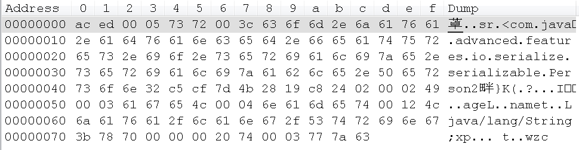

# 1. 阅读ObjectOutputStream源码，弄懂writeObject的流程

数据类使用 Person2.java:

```java
public class Person2 implements Serializable {
    private static final long serialVersionUID = 1L;
    private String name;
    private int age;
    public Person2(String name, int age) {
        this.name = name;
        this.age = age;
    }
    public String getName() {
        return name;
    }
    public void setName(String name) {
        this.name = name;
    }
    public int getAge() {
        return age;
    }
    public void setAge(int age) {
        this.age = age;
    }
}
```

测试代码：

```java
public class SerializableTest {
    public static void main(String[] args) throws IOException, ClassNotFoundException {
        String filePath = "./obj.object";
        FileOutputStream fos = new FileOutputStream(filePath);
        ObjectOutputStream oos = new ObjectOutputStream(fos);
        oos.writeObject(new Person2("wzc", 32));
        oos.close();
    }
}
```

运行程序，得到 obj.object 文件，使用 NotePad++打开， Hex Editor 插件查看对应的二进制文件：



跟踪源码：

#### 在构造 `ObjectOutputStream` 时，会调用 `writeStreamHeader()` 写入 aced 以及 0005。

调用 `writeObject()` 方法：

```java
public final void writeObject(Object obj) throws IOException {
    if (enableOverride) { // 这个值在构造方法方法中被初始化为false
        writeObjectOverride(obj);
        return;
    }
    try {
        writeObject0(obj, false); // => 代码走这里
    } catch (IOException ex) {
        if (depth == 0) {
            writeFatalException(ex);
        }
        throw ex;
    }
}
```

#### 调用 `writeObject0()` 方法，它是 `writeObject()` 方法的下层实现：

```java
private void writeObject0(Object obj, boolean unshared)
    throws IOException
{
    boolean oldMode = bout.setBlockDataMode(false);
    depth++;
    try {
        // handle previously written and non-replaceable objects
        // check for replacement object
        // if object replaced, run through original checks a second time
       	// 省略掉本次流程无关的代码，因为对象之前没有写过也没有没有发生替换。
        ObjectStreamClass desc = desc = ObjectStreamClass.lookup(cl, true);
        // remaining cases
        // obj 是 Person2 对象，它实现了 Serializable 接口，所以会进入 obj instanceof Serializable 分支
        if (obj instanceof String) {
            writeString((String) obj, unshared);
        } else if (cl.isArray()) {
            writeArray(obj, desc, unshared);
        } else if (obj instanceof Enum) {
            writeEnum((Enum<?>) obj, desc, unshared);
        } else if (obj instanceof Serializable) { 
            writeOrdinaryObject(obj, desc, unshared); // => 代码走这里
        } else {
            if (extendedDebugInfo) {
                throw new NotSerializableException(
                    cl.getName() + "\n" + debugInfoStack.toString());
            } else {
                throw new NotSerializableException(cl.getName());
            }
        }
    } finally {
        depth--;
        bout.setBlockDataMode(oldMode);
    }
}
```

#### 调用 `writeOrdinaryObject()` 方法，这个方法的作用是把普通的序列化对象的表现写入到流中：

```java
private void writeOrdinaryObject(Object obj,
                                 ObjectStreamClass desc,
                                 boolean unshared)
    throws IOException
{
    try {
        desc.checkSerialize();
        bout.writeByte(TC_OBJECT);// 表示写入新的对象
        writeClassDesc(desc, false);
        handles.assign(unshared ? null : obj);
        // Person2 没有实现 Externalizable 接口，所以走 else 分支
        if (desc.isExternalizable() && !desc.isProxy()) {
            writeExternalData((Externalizable) obj);
        } else {
            writeSerialData(obj, desc); // => 代码走这里
        }
    } finally {
        if (extendedDebugInfo) {
            debugInfoStack.pop();
        }
    }
}
```

#### 调用 `writeSerialData()` 方法：

```java
private void writeSerialData(Object obj, ObjectStreamClass desc)
    throws IOException
{
    ObjectStreamClass.ClassDataSlot[] slots = desc.getClassDataLayout(); // slots 长度为 1
    for (int i = 0; i < slots.length; i++) {
        ObjectStreamClass slotDesc = slots[i].desc;
        // Person2 没有声明 writeObject() 方法，所以 slotDesc.hasWriteObjectMethod() 是 false
        if (slotDesc.hasWriteObjectMethod()) {
           // 省略无关代码
        } else {
            defaultWriteFields(obj, slotDesc); // => 代码走这里
        }
    }
}
```

#### 调用 `defaultWriteFields()` 方法，这个方法的作用是获取给定对象序列化字段的值，并把值写入到流中：

```java
private void defaultWriteFields(Object obj, ObjectStreamClass desc)
    throws IOException
{
    Class<?> cl = desc.forClass();
    if (cl != null && obj != null && !cl.isInstance(obj)) {
        throw new ClassCastException();
    }
    desc.checkDefaultSerialize();
    int primDataSize = desc.getPrimDataSize(); // 获取对象中原始类型字段的累加字节数，这里只有一个 int age，所以是 4。
    if (primVals == null || primVals.length < primDataSize) {
        primVals = new byte[primDataSize]; // 创建容器参数
    }
    desc.getPrimFieldValues(obj, primVals); // 把 age 字段的值 32 写入到 primVals 这个容器参数里
    bout.write(primVals, 0, primDataSize, false); // 把 age 值写入到流中。
    ObjectStreamField[] fields = desc.getFields(false);
    Object[] objVals = new Object[desc.getNumObjFields()]; // 获取对象字段的数组，长度是 1
    int numPrimFields = fields.length - objVals.length; // 原始类型字段的个数，这里是 1
    desc.getObjFieldValues(obj, objVals);
    for (int i = 0; i < objVals.length; i++) {
        try {
            writeObject0(objVals[i],
                         fields[numPrimFields + i].isUnshared()); // => 代码走这里
        } finally {
            if (extendedDebugInfo) {
                debugInfoStack.pop();
            }
        }
    }
}
```

#### 调用 `writeObject0(Object obj, boolean unshared)` 方法，obj 的值就是 "wzc" 这个字符串：

```java
private void writeObject0(Object obj, boolean unshared)
    throws IOException
{
    boolean oldMode = bout.setBlockDataMode(false);
    depth++;
    try {
        // handle previously written and non-replaceable objects
        // check for replacement object
        // if object replaced, run through original checks a second time
       	// 省略掉本次流程无关的代码，因为对象之前没有写过也没有没有发生替换。
        ObjectStreamClass desc = desc = ObjectStreamClass.lookup(cl, true);
        // remaining cases
        // obj 是 String 对象，所以会进入 obj instanceof String 分支
        if (obj instanceof String) {
            writeString((String) obj, unshared); // => 代码走这里
        } else if (cl.isArray()) {
            writeArray(obj, desc, unshared);
        } else if (obj instanceof Enum) {
            writeEnum((Enum<?>) obj, desc, unshared);
        } else if (obj instanceof Serializable) { 
            writeOrdinaryObject(obj, desc, unshared); 
        } else {
            if (extendedDebugInfo) {
                throw new NotSerializableException(
                    cl.getName() + "\n" + debugInfoStack.toString());
            } else {
                throw new NotSerializableException(cl.getName());
            }
        }
    } finally {
        depth--;
        bout.setBlockDataMode(oldMode);
    }
}
```

#### `writeString()` 方法，把字符串写入流中：

```java
private void writeString(String str, boolean unshared) throws IOException {
    handles.assign(unshared ? null : str);
    long utflen = bout.getUTFLength(str);
    if (utflen <= 0xFFFF) {
        bout.writeByte(TC_STRING);
        bout.writeUTF(str, utflen);
    } else {
        bout.writeByte(TC_LONGSTRING);
        bout.writeLongUTF(str, utflen);
    }
}
```


# 2. 自己写demo重现Serializable的细节问题

#### 多引用写入

多引用写入是指同一个对象，先执行一次序列化操作；然后，修改这个对象的一些值，再次执行序列化操作。执行两次反序列化操作，取出的对象内容是一样的（是第一次执行序列化的内容），地址也是一样的。

解决办法1：在执行第二次序列化操作之前，执行 `oos.reset(); `操作；

解决办法2：替换第二次序列化操作的代码为 `oos.writeUnshared(Object);`操作；

解决办法3：避免使用多引用写入，重新构造对象进行写入。

#### serialVersionUID 需要显式地声明

这样有助于最大限度地恢复数据

#### 反序列化可以打破单例模式

解决办法：在单例类中添加 `readResolve()`方法

```java
private Object readResolve() {
        return SingletonHolder.instance;
}
```

#### 被 `transient` 关键字修饰的成员变量，不会参与序列化与反序列化

用途：

如果类中的成员没有实现 `Serializable` 接口（如 `Bitmap`），而我们恰好也无需序列化这个成员时，这时可以用 `transient` 关键字来修饰这个字段，这样就不会影响类的序列化。

如果类中的成员是敏感信息，不希望序列化到磁盘上，避免信息泄漏（如密码等），这时可以用 `transient` 关键字修饰这个字段，阻止它参与序列化。

#### `static` 修饰的变量不参与序列化

序列化针对的是对象的属性。

#### 子类实现序列化,父类不实现序列化

如果父类没有空参构造器，那么会报错：java.io.InvalidClassException: com.java.advanced.features.io.serialize.serializable.Man; no valid constructor；

如果父类有空参构造器，那么不会报错，但是父类的值不会保存。解决办法：

让子类负责序列化与反序列化父类的域，在子类中添加 `writeObject()` 和 `readObject()` 方法

```java
private void writeObject(ObjectOutputStream oos) throws IOException {
    // 先序列化本类对象
    oos.defaultWriteObject();
    // 再序列化父类的域
    oos.writeObject(getName());
    oos.writeInt(getAge());
}
private void readObject(ObjectInputStream ois) throws IOException, ClassNotFoundException {
    // 先反序列化本类对象
    ois.defaultReadObject();;
    // 再反序列化父类的域
    setName((String) ois.readObject());
    setAge(ois.readInt());
```


#### 父类实现了Serializable，子类没有, 子类可以正常进行序列化


#### 序列化的时候多一个字段，反序列化的时候少一个字段，不会报错，反之，也不会报错

注意：要显式地声明 `serialVersionUID`，否则会报错：

```
local class incompatible: stream classdesc serialVersionUID = 6835789101891955100, local class serialVersionUID = 4582138150451985649
```


